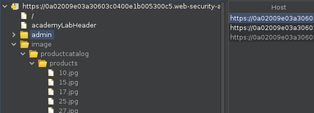
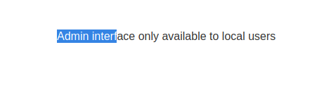
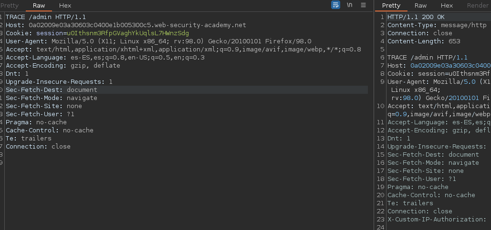
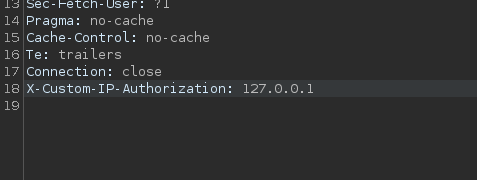

# Authentication bypass via information disclosure

**Level:** <mark style="color:green;">**Apprentice**</mark>

<figure><figcaption></figcaption></figure>

In this lab we need to look for a login bypass and once we have access delete user carlos.

<figure><figcaption>
/admin
</figcaption></figure>

There is an admin directory like in the pass challenge.&#x20;

<figure><figcaption></figcaption></figure>

When you try to see what is in the directory, you'll see the following. What can we try to do to bypass the login and get in as admin user? We can try to do a **TRACE request** to this directory and see if we can see some useful **headers.**

### What is TRACE?

* The HTTP TRACE method is normally used to return the full HTTP request back to the requesting client for proxy-debugging purposes.

<figure><figcaption></figcaption></figure>

Here we see that the server responds back we a parameter that we can use to bypass the login and get into the admin directory straight into it. We exploit this as the following.

<figure><figcaption></figcaption></figure>

Using **X-Custom-IP-Authorization** header and modifying the IP to the localhost in whatever requests we want, we can bypass it. **Now make a GET requests to the admin directory with the modified header.**
