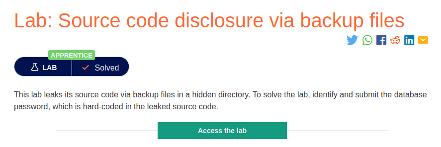
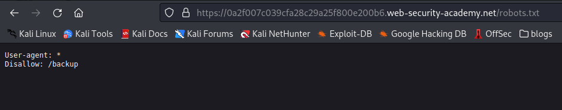
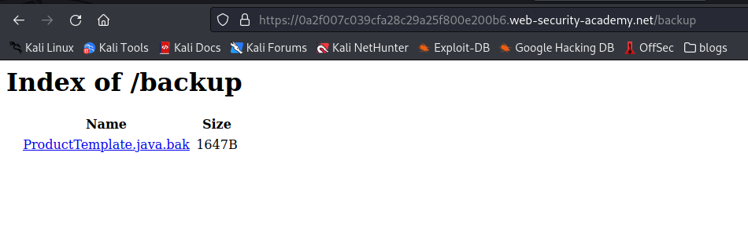
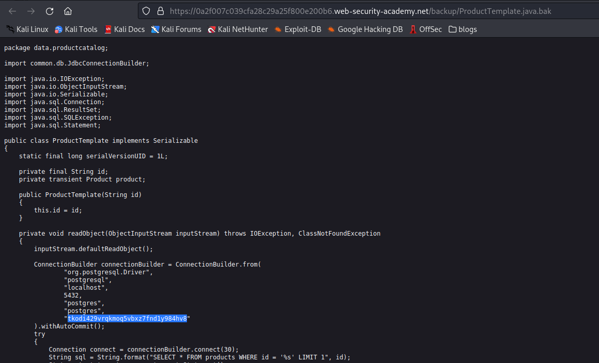

# Backup Leakage

**Level:** <mark style="color:green;">**Apprentice**</mark>

<figure><figcaption></figcaption></figure>

* In this lab there is a hidden file that contains a **piece source code of source-code** of the application.

<figure><figcaption></figcaption></figure>

* Here I found I have access to **robots.txt.** In the content we see another directory called **backup.**

<figure><figcaption></figcaption></figure>

* Here we can **directory list the directory hopefully** and get that interesting file of the page. Not always we're going to have the capacity of directory listing throw one of these things, sometimes we might need to **brute-force for an interesting file**.

<figure><figcaption></figcaption></figure>
