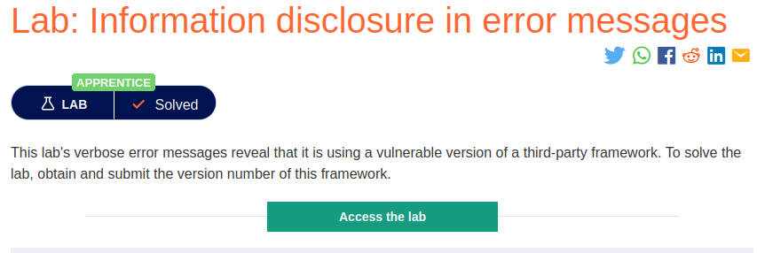
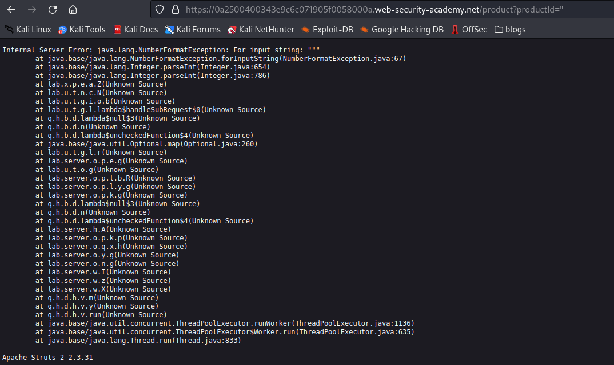

# Error Messages

**Level:** <mark style="color:green;">**Apprentice**</mark>

<figure><figcaption></figcaption></figure>

* To solve this lab basically you just need to cause an error on the server, so the server reveals sensitive info about the web application.

<figure><figcaption></figcaption></figure>

* Looking around I tried to cause an error by putting a colon on a parameter called **productid**. Then the application haves a **500 internal server error and gives me the version of the framework** that we want to see that is **Apache Struts 2 2.3.31.**
