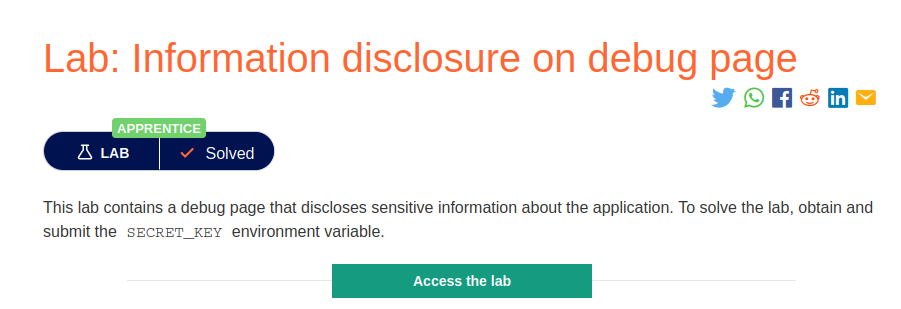
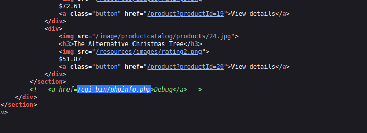
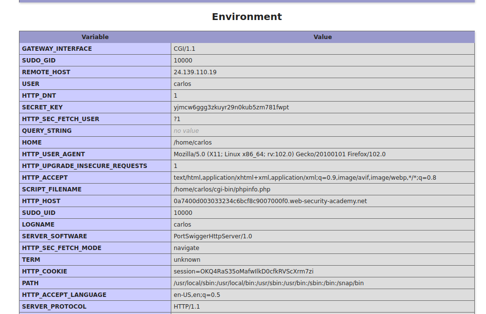

# Filtering a debug page

**Level:** <mark style="color:green;">**Apprentice**</mark>

<figure><figcaption></figcaption></figure>

* In this lab the objective is to find a secret key that is somewhere on the application.

<figure><figcaption></figcaption></figure>

* Looking around in the **html** content of the page I saw this comment filtering a debug directory (**phpinfo.php**), so I dig into and see what I can find.

<figure><figcaption></figcaption></figure>

* Here in the phpinfo directory we can see a lot of information **of the server environment.** Down in the file we can see the **secret\_key** that we need to complete the challenge.
