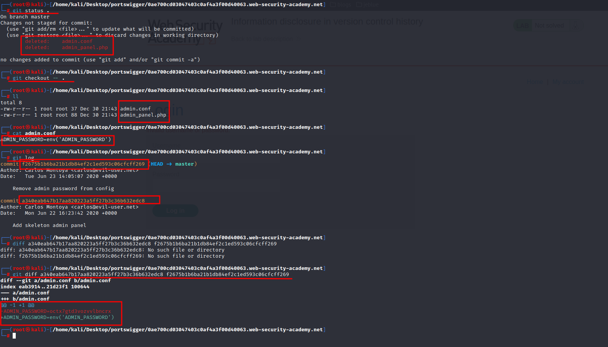

# Information disclosure in version control history

**Level:** <mark style="color:blue;">**Practitioner**</mark>

<figure><figcaption></figcaption></figure>

* Practitioner level, we need to get the admin password this time.

<figure><figcaption></figcaption></figure>

* To automate a little recon, I used _**dirsearch**_ and found a **/.git** exposed.
* So, let's make recursive **wget** on the directory and make some git recon.

<figure><figcaption></figcaption></figure>

* Now in the image below I enumerate the git a little bit and one of the commits contains the admin password.
* Just Login with the credentials and delete the user, Carlos.&#x20;

<figure><figcaption></figcaption></figure>
