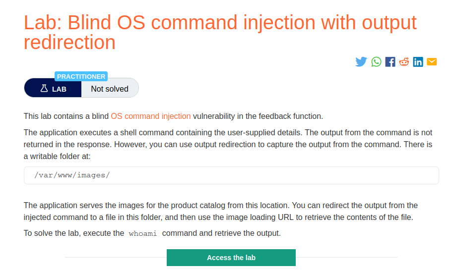
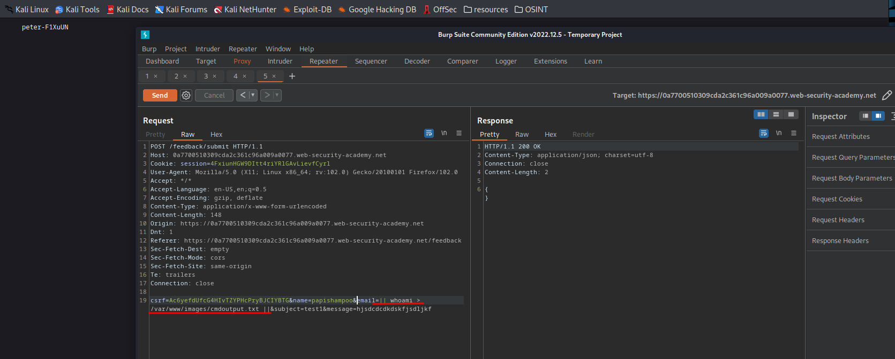

# Blind OS command injection with output redirection

**Level:** <mark style="color:blue;">**Practitioner**</mark>

<figure><figcaption></figcaption></figure>

* Now we need to extract information from the server using the writable directory `/var/www/images`.

<figure><figcaption></figcaption></figure>

* So, start with redirecting the output of your command (whoami) to the directory /var/www/images, and because we don't have created the file, we are trying to redirect the output, it will created for us.
* Use the parameter that points to images (filename=\<image>), to point to your file and see the contents of it.
