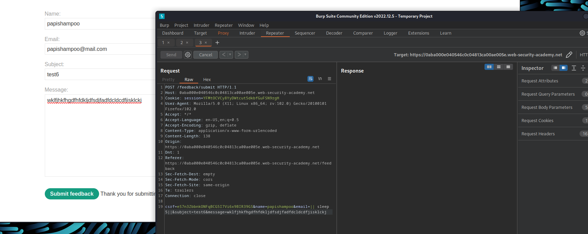

# Blind OS command injection with time delays

**Level:** <mark style="color:blue;">**Practitioner**</mark>

<figure><figcaption></figcaption></figure>

* This time we cannot see the output at first instance.
* With Burp Suite try to fuzz every input with the sleep command and different ways to concatenate our commands, to see where we can inject our commands.

<figure><figcaption></figcaption></figure>

* Note that the email parameter is injectable.
* Set the sleep to 10 seconds to complete the challenge.
