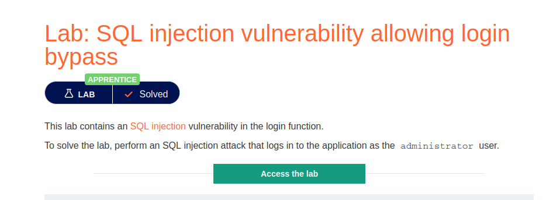
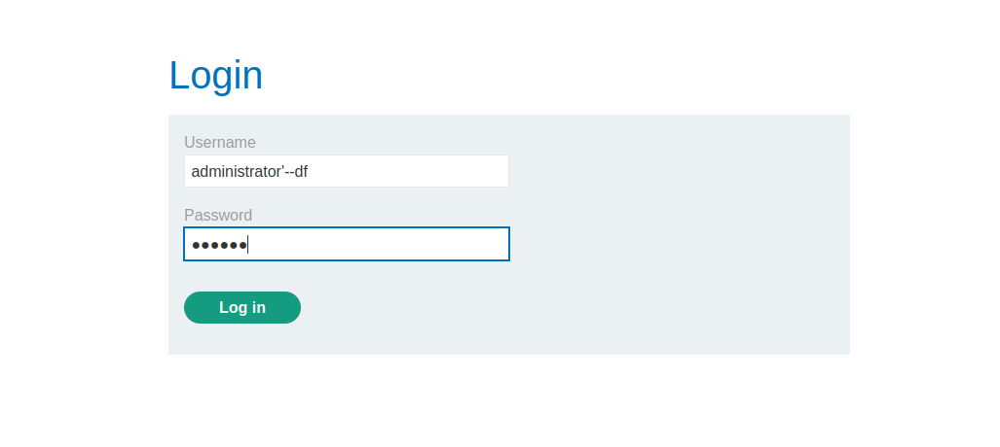
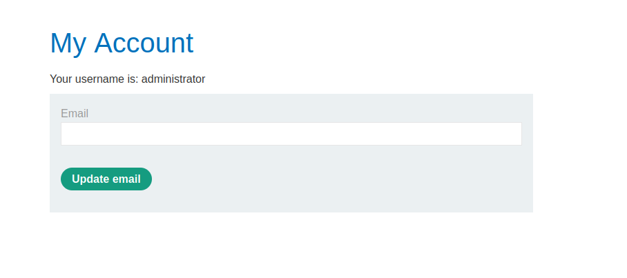

# SQL injection vulnerability allowing login bypass

**Level:** <mark style="color:green;">**Apprentice**</mark>

<figure><figcaption></figcaption></figure>

* How can we bypass the login abusing SQLi?&#x20;

<figure><figcaption></figcaption></figure>

* Usually, you will test to bypass a login page using the following injected parameters.
* What you are doing is commenting the rest of the query to login as a valid user and don't valid the password.

<figure><figcaption></figcaption></figure>
