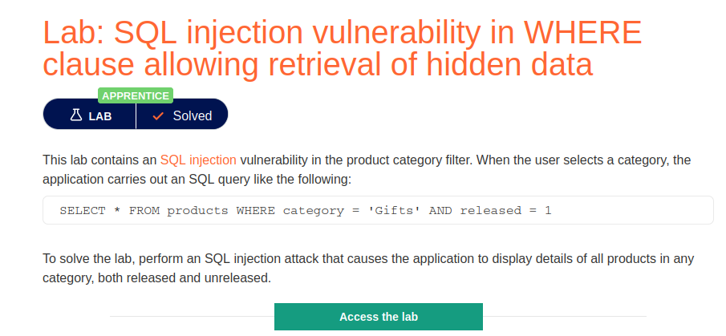
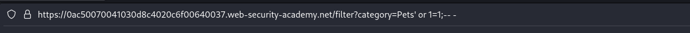
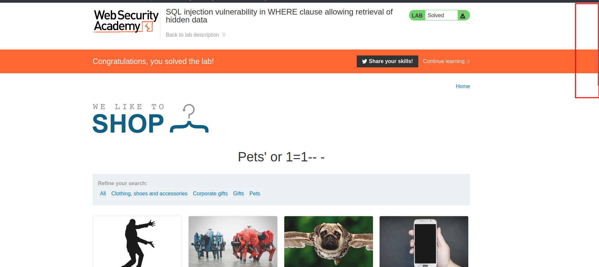

# SQL injection vulnerability in WHERE clause allowing retrieval of hidden data

**Level:** <mark style="color:green;">**Apprentice**</mark>

<figure><figcaption></figcaption></figure>

* Basically, in this lab we need to retrieve post that we don't suppose to see.
* How can we do that with SQL Injection?
* Supposing that the page is making a `SELECT * FROM products WHERE category = 'Gifts' AND released = 1`
* We ca try to inject some SQL and make it look like this `SELECT * FROM products WHERE category = 'Gifts' AND released = 1`**'**  `or 1=1;--`
* &#x20;Knowing that **1=1 is equal True** it will execute our simple payload.
* In the following photo below, we make a check trying to inject a **`' or 1=1;-- -`** to see if it retrieves all the post that are in hidden too with our visible post.

<figure><figcaption></figcaption></figure>

* Now as we can see below, we see other post that we do not see previously.

<figure><figcaption></figcaption></figure>
