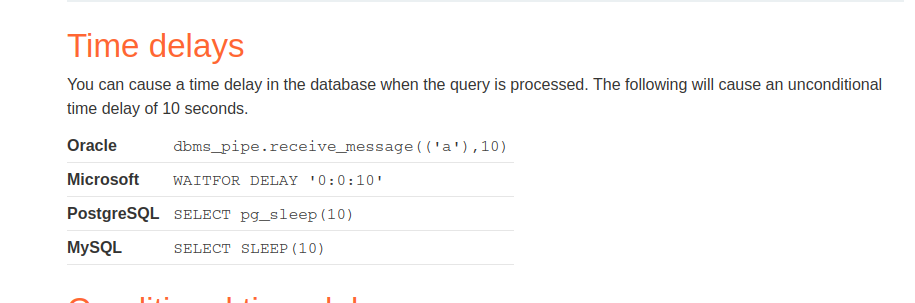

# Blind SQL injection with time delays

**Level:** <mark style="color:blue;">**Practitioner**</mark>

<figure><figcaption></figcaption></figure>

* Increasing the dificulty this time.
* Let's say a case when you don't get any of the past SQLi to work.
* Well, try a SQL injection time based.

<figure><figcaption></figcaption></figure>

* In the following I'm assuming that the SQL is a MySQL, but we don't get anything.
* Try to guess the SQL.

<figure><figcaption></figcaption></figure>

* Finally, I found that using a PostgreSQL sleep, the server waits my 5 seconds.
* Now we know that the SQL is PostgreSQL and we need to do a time based SQLi to retrieve the contents.

<figure><figcaption></figcaption></figure>

* Use the porswigger cheat sheet when you feel lost, is super useful.
