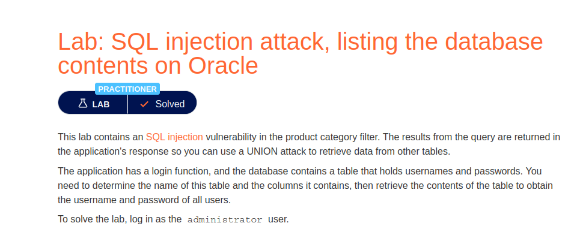
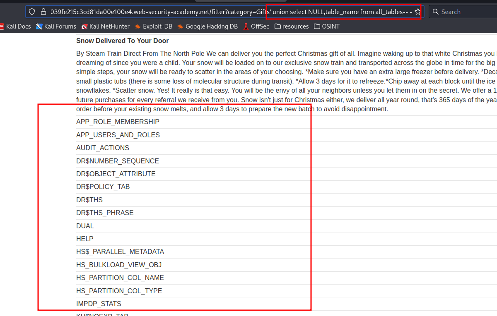
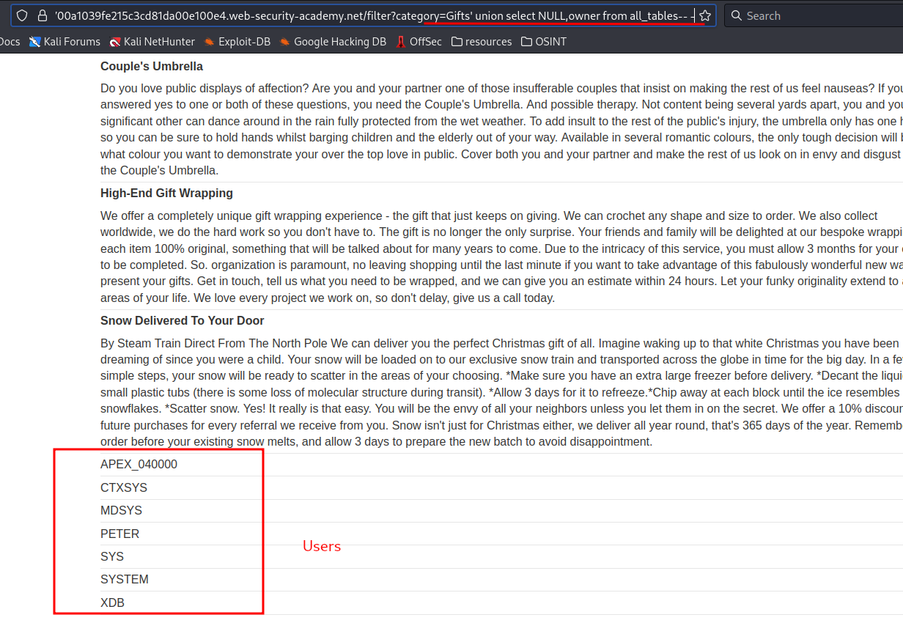
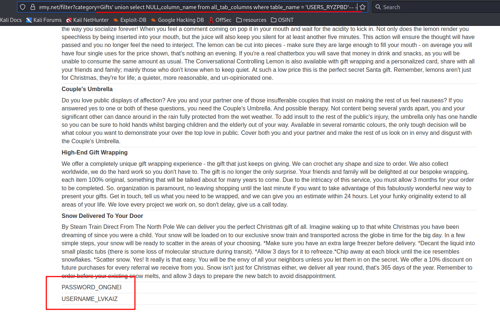
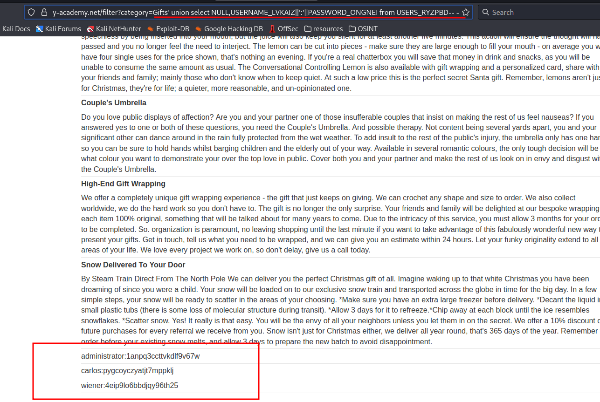

# SQL injection attack, listing the database contents on Oracle

**Level:** <mark style="color:blue;">**Practitioner**</mark>

<figure><figcaption></figcaption></figure>

* Now let's apply all our knowledge dumping an Oracle database.

<figure><figcaption></figcaption></figure>

* Remember that because is oracle is some different logic.
* Here we see all the tables on the DB that we can use.

<figure><figcaption></figcaption></figure>

* We can filter the contents by using a user from the DB.
* To list the Users, use the following payload in the image.

<figure><figcaption></figcaption></figure>

* Now use the user to filter by it.

<figure><figcaption></figcaption></figure>

* Im seeing an interesting columns so lets get its contents.

<figure><figcaption></figcaption></figure>

* Here I used this little trick to represent the content more fancy and get the contents of **Users\_XXXX**.
* The difference between other databases from this is that you have different commands and its more special because of that.
