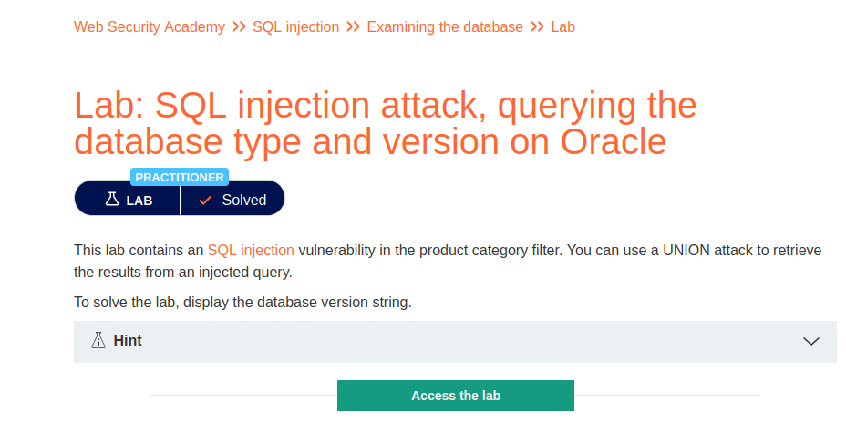
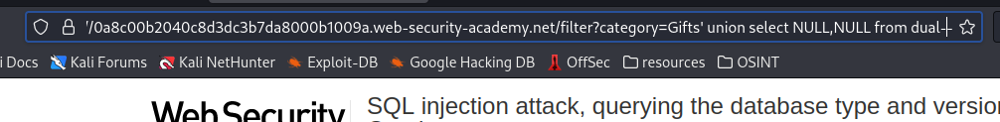
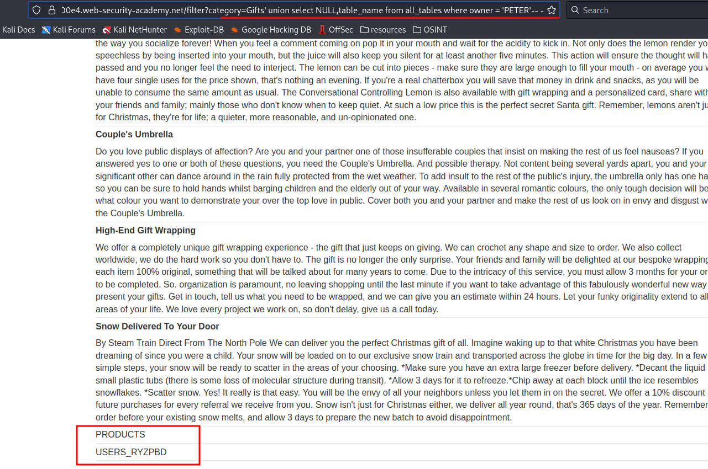

# SQL injection attack, querying the database type and version on Oracle

**Level:** <mark style="color:blue;">**Practitioner**</mark>

<figure><figcaption></figcaption></figure>

* Now let's retrieve information from an Oracle database.
* This time varies a little bit.

<figure><figcaption></figcaption></figure>

* As in the other challenges, we start getting the number of columns, but this time we need to put "**from dual"** at the end of our query, that's how oracle SQL injections works.

<figure><figcaption></figcaption></figure>

* In oracle we can specify what databases we want by passing a user or other type of commands.
* You can look at the Portswigger SQLi cheat sheet to find more information about it.
* The way to get tables, columns and other stuff is different from other databases like MySQL.

<figure><figcaption></figcaption></figure>

* Here we see the columns that we want to dump using the following injection showed in the image.

<figure><figcaption></figcaption></figure>

* To dump those users and passwords we use the following injection and remember to use the from dual at the end.
