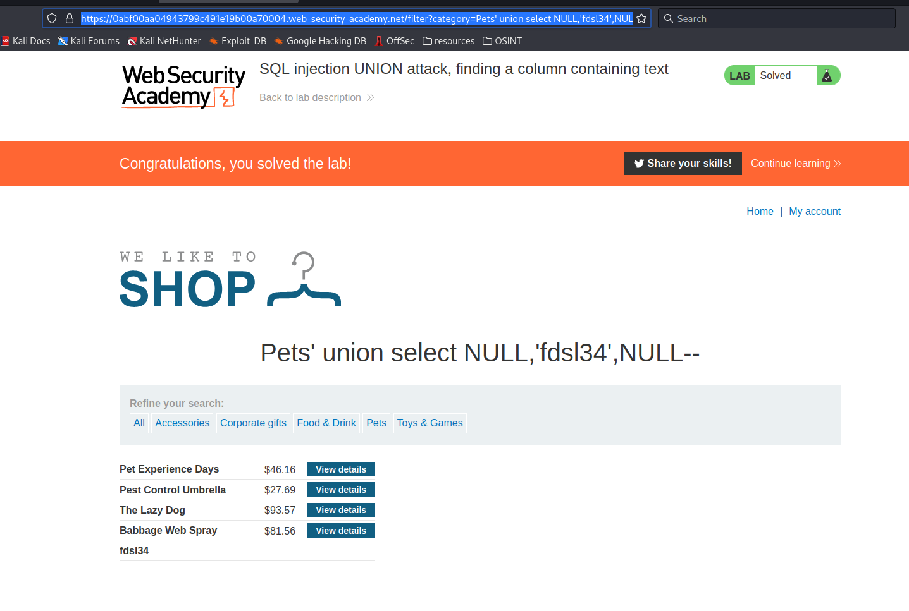

# SQL injection UNION attack, finding a column containing text

**Level:** <mark style="color:blue;">**Practitioner**</mark>

<figure><figcaption></figcaption></figure>

* This time what we need to do is find a writable field to retrieve info about other tables, users, DB's.

<figure><figcaption></figcaption></figure>

* First find out how many columns are in the following table you are using.

<figure><figcaption></figcaption></figure>

* Now to know the writable field, try to go on each column field replacing it with a simple string as the following.
