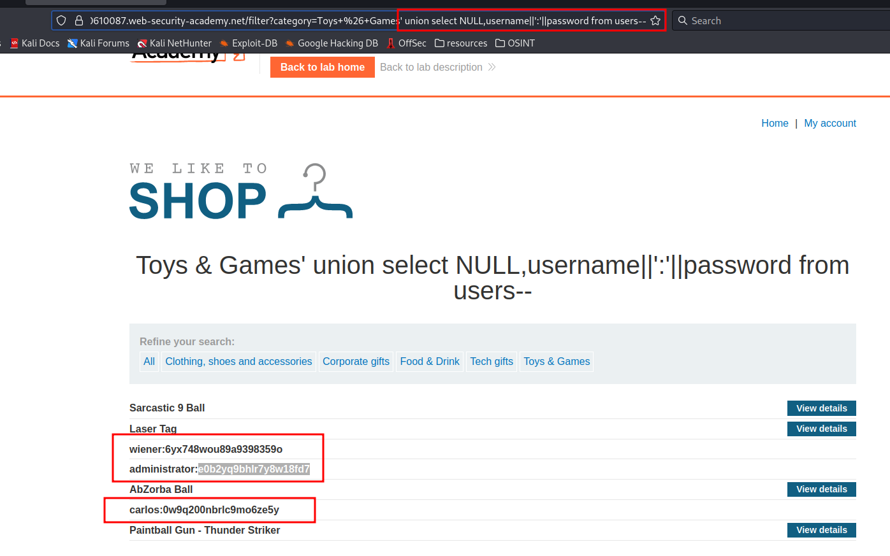

# SQL injection UNION attack, retrieving multiple values in a single column

**Level:** <mark style="color:blue;">**Practitioner**</mark>

<figure><figcaption></figcaption></figure>

* In this lab you just need to do what we do in the past **SQLi** lab.

<figure><figcaption></figcaption></figure>

* As you can see in the image I use a union-based payload to retrieve the content of the table users and represented in a better way in the start.
