# Crocc Crew

**Difficulty: **<mark style="color:purple;">**Insane**</mark>

## Reconnaissance

### Nmap Results

```java
Starting Nmap 7.94 ( https://nmap.org ) at 2023-07-18 17:54 EDT
Stats: 0:00:42 elapsed; 0 hosts completed (1 up), 1 undergoing Service Scan
Service scan Timing: About 90.91% done; ETC: 17:55 (0:00:04 remaining)
Nmap scan report for 10.10.232.204
Host is up (0.25s latency).

PORT      STATE SERVICE       VERSION
53/tcp    open  domain        Simple DNS Plus
80/tcp    open  http          Microsoft IIS httpd 10.0
| http-methods: 
|_  Potentially risky methods: TRACE
|_http-server-header: Microsoft-IIS/10.0
135/tcp   open  msrpc         Microsoft Windows RPC
139/tcp   open  netbios-ssn   Microsoft Windows netbios-ssn
445/tcp   open  microsoft-ds?
636/tcp   open  tcpwrapped
3269/tcp  open  tcpwrapped
3389/tcp  open  ms-wbt-server Microsoft Terminal Services
| rdp-ntlm-info: 
|   Target_Name: COOCTUS
|   NetBIOS_Domain_Name: COOCTUS
|   NetBIOS_Computer_Name: DC
|   DNS_Domain_Name: COOCTUS.CORP
|   DNS_Computer_Name: DC.COOCTUS.CORP
|   Product_Version: 10.0.17763
|_  System_Time: 2023-07-18T21:59:59+00:00
|_ssl-date: 2023-07-18T22:00:38+00:00; +4m32s from scanner time.
| ssl-cert: Subject: commonName=DC.COOCTUS.CORP
| Not valid before: 2023-07-17T21:46:15
|_Not valid after:  2024-01-16T21:46:15
9389/tcp  open  mc-nmf        .NET Message Framing
49670/tcp open  ncacn_http    Microsoft Windows RPC over HTTP 1.0
49676/tcp open  msrpc         Microsoft Windows RPC
Service Info: OS: Windows; CPE: cpe:/o:microsoft:windows

Host script results:
| smb2-time: 
|   date: 2023-07-18T21:59:59
|_  start_date: N/A
| smb2-security-mode: 
|   3:1:1: 
|_    Message signing enabled and required
|_clock-skew: mean: 4m31s, deviation: 0s, median: 4m31s

Service detection performed. Please report any incorrect results at https://nmap.org/submit/ .
Nmap done: 1 IP address (1 host up) scanned in 104.20 seconds
```

### HTTP - Port 80

<figure>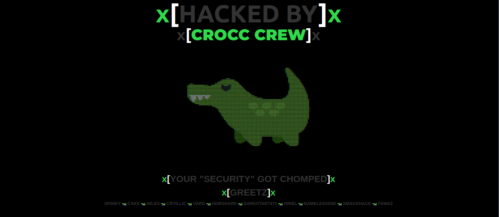<figcaption></figcaption></figure>

Starting to enumerate what is on port 80, we can see that a group of hackers just hacked this windows server.

So, let's start to hack back the system trying posible exiting directories like robots.txt.

<figure>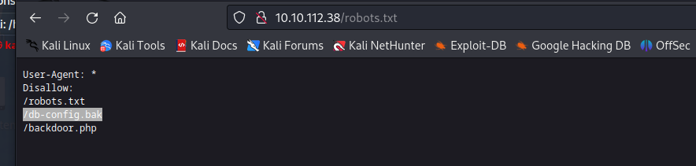<figcaption></figcaption></figure>

We can see a db configuration backup, try to open it.

<figure>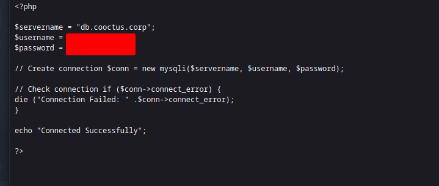<figcaption></figcaption></figure>

Inside the backup file we have a username and a password, this credentials can be useful further.

### RDP - Port 3389

<figure>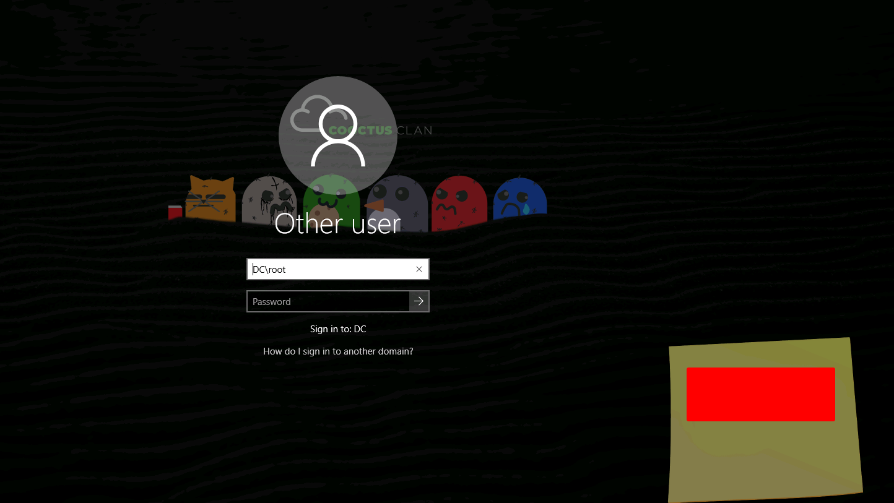<figcaption></figcaption></figure>

Enumerating RDP we see a sticky note with credentials too, just copy for further enumeration and exploitation.


PD: The credentials found on the web pages are not so important as the RDP founded credentials.


### SMB - Port 445

<figure>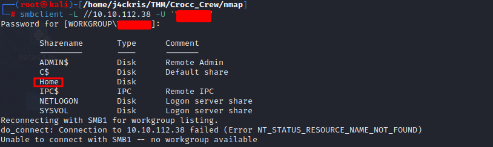<figcaption></figcaption></figure>

Now we want to enumerate **SMB**, just to not make you lose your time in a rabbit hole, use the credentials founded in **RDP** to enumerate **SMB**.

<figure>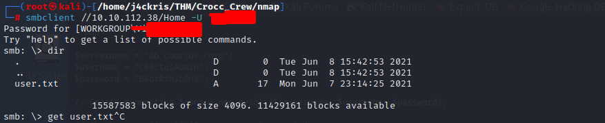<figcaption></figcaption></figure>

You will that inside the directory **Home** is a user flag.

### LDAP - Port 636

<figure>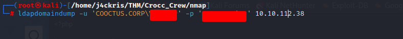<figcaption></figcaption></figure>

Use **ldapdomaindump** to get information the users in the domain and look for possible attack vectors.

<figure>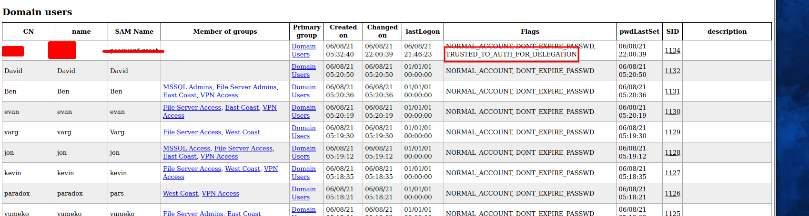<figcaption></figcaption></figure>

Looking the ldap users dump, we can see a specific user have the flag **"TRUSTED\_TO\_AUTH\_FOR\_DELEGATION"**.

AD delegation enables you to grant users the permissions to perform tasks that require elevated permissions.

## Exploitation

<figure>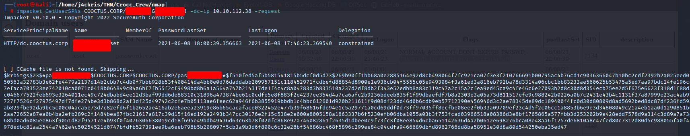<figcaption></figcaption></figure>

Let' use impacket-spnuser to to find users SPNs.

<figure>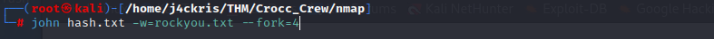<figcaption></figcaption></figure>

Once you get the hash continue to crack it.

<figure>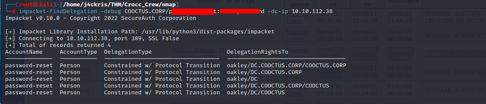<figcaption></figcaption></figure>

Use_`impacket-finddelegation`_to find delegation to extract more information about the **delegation**.

<figure>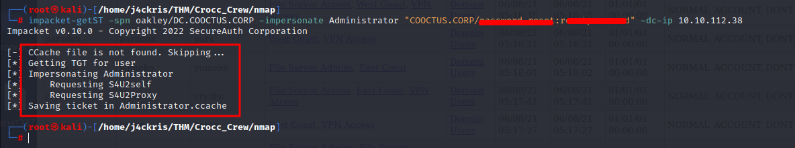<figcaption></figcaption></figure>

Use the _`impacket-getST`_ script to impersonate and get the ticket of the Administrator user.

In this case we are assuming the target SPN is allowed for delegation.

The output of the file will be a _Administator.ccache_, export it to **KRB5CCNAME**.

<figure>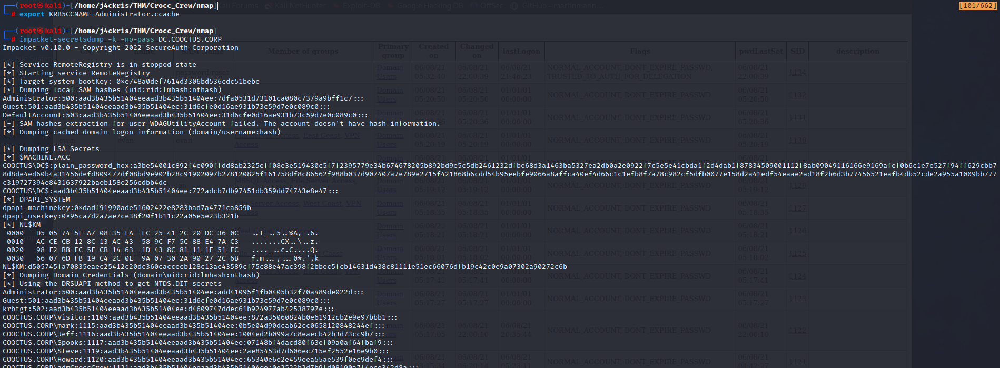<figcaption></figcaption></figure>

Use `impacket-secretsdump` like in the image above to extract all users' hashes and save it.

<figure>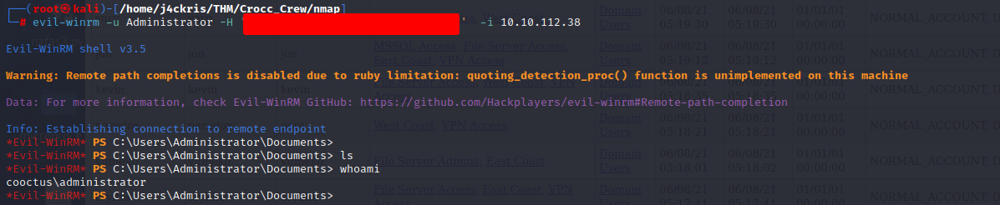<figcaption></figcaption></figure>

Now access the server using evil-winrm and the hash of the domain administrator.

Get the flags to complete the room ; )
